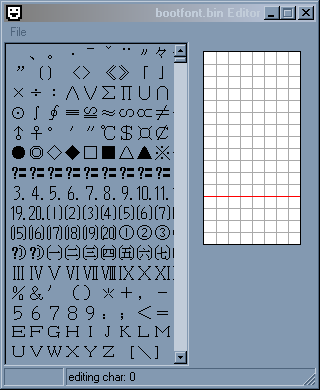

# Screenshots from old versions

Below are some screenshots from the development process. Individual versions haven't been saved since I haven't used any version control system at the time:

<table>
  <tr>
    <td> 2010.05.22
    <td> 2010.05.22
    <td> 2010.05.22
    <td> 2010.05.22
    <td> 2010.05.22
    <td> 2010.05.22
  </tr>
  <tr>
    <td> 2010.05.22
    <td> 2010.05.23
    <td> 2010.05.30
    <td> 2010.06.03
    <td> 2010.06.03
    <td> 2010.06.03
  </tr>
  <tr>
    <td> 2010.06.03
    <td> 2010.06.03
    <td> 2010.06.04
    <td> 2010.06.08
    <td> 2010.06.11
    <td> 2010.06.12
  </tr>
  <tr>
    <td> 2010.10.16
    <td>
    <td>
    <td>
    <td>
  </tr>

</table>
